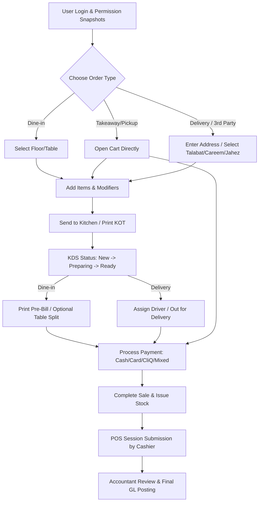

# Restaurant POS Implementation Plan

This document outlines the architecture, database changes, backend APIs, and frontend updates required to implement the **Restaurant POS Addendum** (`docs/pos/Restaurant_POS_Requirements_Bilingual_MD_Style.md`).

---

## 1. Architectural Overview & Workflow

The Restaurant POS extends the base POS system by adding:
1. **Dine-in Workflow**: Floor plans, table states, waiter ordering, bill splitting/merging, and pre-billing.
2. **Kitchen Workflow (KOT & KDS)**: Kitchen Order Tickets generated and routed to preparation stations, and a Kitchen Display System for preparing, readying, and serving items.
3. **Delivery Workflow**: Customer addresses, driver assignments, delivery fees, and delivery statuses.
4. **Third-Party Delivery Channel Settlements**: Direct mapping of orders from Talabat, Careem, and Jahez to dedicated receivable accounts.
5. **Session Submission & Accountant Review**: Cashier operational shift submission, variance explanation, and accountant review/posting.
6. **Order Type Corrections**: Post-sale changes to order types with audit logs and ledger adjustment.

### Recommended System Flow



---

## 2. Database Schema Extensions (`prisma.schema`)

We will add the following enums and models, and extend existing models in `backend/prisma/schema.prisma`.

### 2.1 Enums

```prisma
enum OrderType {
  DINE_IN
  TAKEAWAY
  DELIVERY
  PICKUP
}

enum TableStatus {
  AVAILABLE
  OCCUPIED
  RESERVED
  WAITING_FOR_PAYMENT
  CLEANING
}

enum KitchenStatus {
  NEW
  PREPARING
  READY
  SERVED
}

enum DeliveryStatus {
  PENDING
  PREPARING
  READY_FOR_DELIVERY
  OUT_FOR_DELIVERY
  DELIVERED
  CANCELLED
}
```

### 2.2 New Models

```prisma
model PosTable {
  id               String          @id @default(cuid())
  tableNumber      String          @unique
  capacity         Int
  status           TableStatus     @default(AVAILABLE)
  activeInvoiceId  String?         @unique
  activeInvoice    SalesInvoice?   @relation("TableActiveInvoice", fields: [activeInvoiceId], references: [id])
  assignedWaiterId String?
  assignedWaiter   User?           @relation("TableWaiter", fields: [assignedWaiterId], references: [id])
  createdAt        DateTime        @default(now())
  updatedAt        DateTime        @updatedAt
  invoices         SalesInvoice[]  @relation("TableInvoiceHistory")
}

model DeliveryCompany {
  id                  String         @id @default(cuid())
  name                String         @unique
  arabicName          String?
  receivableAccountId String
  receivableAccount   Account        @relation("DeliveryCompanyReceivable", fields: [receivableAccountId], references: [id])
  commissionRate      Decimal        @default(0) @db.Decimal(5, 2) // e.g. 15.00 for 15%
  commissionAccountId String?
  commissionAccount   Account?       @relation("DeliveryCompanyCommission", fields: [commissionAccountId], references: [id])
  isActive            Boolean        @default(true)
  createdAt           DateTime       @default(now())
  updatedAt           DateTime       @updatedAt
  salesInvoices       SalesInvoice[]
  posPayments         PosPayment[]
}

model DeliveryDriver {
  id            String         @id @default(cuid())
  name          String
  phone         String?
  isActive      Boolean        @default(true)
  createdAt     DateTime       @default(now())
  updatedAt     DateTime       @updatedAt
  salesInvoices SalesInvoice[]
}

model KitchenOrder {
  id             String             @id @default(cuid())
  orderNumber    String             @unique
  salesInvoiceId String?            @unique
  salesInvoice   SalesInvoice?      @relation(fields: [salesInvoiceId], references: [id], onDelete: SetNull)
  tableId        String?
  tableName      String?
  waiterId       String?
  waiterName     String?
  orderType      OrderType
  status         KitchenStatus      @default(NEW)
  notes          String?
  createdAt      DateTime           @default(now())
  updatedAt      DateTime           @updatedAt
  items          KitchenOrderItem[]
}

model KitchenOrderItem {
  id             String       @id @default(cuid())
  kitchenOrderId String
  kitchenOrder   KitchenOrder @relation(fields: [kitchenOrderId], references: [id], onDelete: Cascade)
  itemId         String
  itemName       String
  quantity       Decimal      @db.Decimal(18, 4)
  modifiers      Json?        // List of modifiers/extra instructions
  status         KitchenStatus @default(NEW)
  notes          String?
  createdAt      DateTime     @default(now())
}

model RestaurantRecipe {
  id          String                     @id @default(cuid())
  itemId      String                     @unique
  item        InventoryItem              @relation(fields: [itemId], references: [id], onDelete: Cascade)
  createdAt   DateTime                   @default(now())
  updatedAt   DateTime                   @updatedAt
  ingredients RestaurantRecipeIngredient[]
}

model RestaurantRecipeIngredient {
  id               String           @id @default(cuid())
  recipeId         String
  recipe           RestaurantRecipe @relation(fields: [recipeId], references: [id], onDelete: Cascade)
  ingredientItemId String
  ingredientItem   InventoryItem    @relation(fields: [ingredientItemId], references: [id], onDelete: Restrict)
  quantity         Decimal          @db.Decimal(18, 4)
  unitOfMeasureId  String?
  createdAt        DateTime         @default(now())
}
```

### 2.3 Extended Existing Models

```prisma
model SalesInvoice {
  // ... existing fields ...
  orderType           OrderType?
  tableId             String?
  table               PosTable?       @relation("TableInvoiceHistory", fields: [tableId], references: [id])
  activeTable         PosTable?       @relation("TableActiveInvoice")
  waiterId            String?
  waiter              User?           @relation("InvoiceWaiter", fields: [waiterId], references: [id])
  serviceChargeAmount Decimal?        @db.Decimal(18, 2) @default(0)
  deliveryFeeAmount   Decimal?        @db.Decimal(18, 2) @default(0)
  driverId            String?
  driver              DeliveryDriver? @relation(fields: [driverId], references: [id])
  deliveryStatus      DeliveryStatus?
  deliveryAddress     String?
  deliveryNotes       String?
  
  // Delivery Company Integration
  deliveryCompanyId   String?
  deliveryCompany     DeliveryCompany? @relation(fields: [deliveryCompanyId], references: [id])
  
  // Kitchen Order Ticket Links
  kitchenOrder        KitchenOrder?
  
  // Audits & Corrections
  originalOrderType   OrderType?
  correctionReason    String?
  isCorrected         Boolean         @default(false)
  correctedAt         DateTime?
  correctedByUserId   String?
  correctedByUser     User?           @relation("InvoiceCorrector", fields: [correctedByUserId], references: [id])
}

model SalesInvoiceLine {
  // ... existing fields ...
  modifiers           Json?           // Modifiers applied (extra cheese, medium-well, etc.)
}

model PosPayment {
  // ... existing fields ...
  deliveryCompanyId   String?
  deliveryCompany     DeliveryCompany? @relation(fields: [deliveryCompanyId], references: [id])
}

model PosSession {
  // ... existing fields ...
  submittedAt         DateTime?
  submittedByUserId   String?
  submittedByUser     User?           @relation("SessionSubmitter", fields: [submittedByUserId], references: [id])
}

model User {
  // ... existing fields ...
  tablesServed        PosTable[]      @relation("TableWaiter")
  invoicesServed      SalesInvoice[]  @relation("InvoiceWaiter")
  correctedInvoices   SalesInvoice[]  @relation("InvoiceCorrector")
  submittedSessions   PosSession[]    @relation("SessionSubmitter")
}
```

---

## 3. Backend API Module (`backend/src/modules/phase-3-sales-receivables/pos`)

We will create new endpoints and modify existing services to support the restaurant logic.

### 3.1 New API Routes

#### Floor & Table Management (`/api/pos/tables`)
* `GET /api/pos/tables`: List all tables and statuses.
* `POST /api/pos/tables/open`: Open a table, link it to a draft invoice, and set status to `OCCUPIED`.
* `POST /api/pos/tables/transfer`: Transfer an active order from table A to table B.
* `POST /api/pos/tables/merge`: Merge multiple tables into one bill.
* `POST /api/pos/tables/split`: Split a table bill (by items, guests, or amounts).

#### Kitchen Display System (`/api/pos/kitchen`)
* `GET /api/pos/kitchen/orders`: Retrieve active kitchen orders grouped by preparation station.
* `PATCH /api/pos/kitchen/items/:id/status`: Update the status of a kitchen item (`PREPARING`, `READY`, `SERVED`).
* `POST /api/pos/kitchen/orders/send`: Generate KOT and push items to KDS.
* `POST /api/pos/kitchen/orders/reprint`: Authorize reprinting of KOT.

#### Delivery Drivers (`/api/pos/delivery`)
* `GET /api/pos/delivery/drivers`: Retrieve active drivers.
* `PATCH /api/pos/delivery/orders/:invoiceId/driver`: Assign a driver to a delivery order.
* `PATCH /api/pos/delivery/orders/:invoiceId/status`: Update delivery status (`OUT_FOR_DELIVERY`, `DELIVERED`, etc.).

#### Delivery Channels & Settings (`/api/pos/delivery-companies`)
* `GET /api/pos/delivery-companies`: List companies (Talabat, Careem, Jahez) and commission rates.
* `POST /api/pos/delivery-companies`: Register/modify companies and map them to receivable accounts.

---

### 3.2 Service & Core Logic Enhancements

#### Recipe-Driven Stock Deductions
When a POS transaction completes, the system currently deduces inventory directly for inventory-tracked items.
For restaurant items (Combos, Prepared Foods), we will look up the `RestaurantRecipe` of the item.
If a recipe is configured, the inventory relief logic in `SalesReceivablesService` will deduct raw ingredients from the specified warehouse instead of the parent menu item.
```typescript
async resolveStockreliefForLine(line, warehouseId, tx) {
  const recipe = await tx.restaurantRecipe.findUnique({
    where: { itemId: line.itemId },
    include: { ingredients: true }
  });
  
  if (recipe) {
    for (const ingredient of recipe.ingredients) {
      await this.inventoryPostingService.issueStock({
        itemId: ingredient.ingredientItemId,
        quantity: ingredient.quantity.mul(line.quantity),
        warehouseId,
        movementType: "SALES_ISSUE"
      }, tx);
    }
  } else {
    // Normal single item deduction
    await this.inventoryPostingService.issueStock({
      itemId: line.itemId,
      quantity: line.quantity,
      warehouseId,
      movementType: "SALES_ISSUE"
    }, tx);
  }
}
```

#### Accounting Treatment for Delivery Companies
For orders made through channels like `Talabat`, payment isn't collected in cash by the cashier.
Instead, it is recorded as a receivable from the delivery partner:
```text
Dr. Talabat Receivable Account (mapped from DeliveryCompany)
Cr. Sales Revenue
Cr. Output VAT
```
Upon payment settlement by Talabat:
```text
Dr. Bank Account
Dr. Delivery Company Commission Expense (calculated via commissionRate)
Cr. Talabat Receivable Account
```

#### Order Type Corrections
The system will allow accountants (or cashiers with override permission) to correct completed sales order types (e.g. changing `Dine-in` to `Takeaway`).
If the change affects:
* **Service charges or delivery fees**: The system will recalculate line totals, tax, and total amount.
* **Payment channels**: The system will reverse the original journal entry and post a corrected one (e.g. moving balance from `Cash` to `Talabat Receivable`).
* **Audit trail**: Persist the `originalOrderType` and `correctionReason` on the `SalesInvoice`.

---

## 4. Frontend UI Design & Flow (`frontend/features/pos`)

We will introduce a series of panels and components to align the register workspace with restaurant operations.

### 4.1 Order Type Selector & Customer Sidebar
* In the cart sidebar, add a toggle for **Dine-in / Takeaway / Delivery / Pickup**.
* If **Dine-in** is selected: Show table selector button.
* If **Delivery** is selected: Require/prompt for customer details, address, and driver assignment, and apply delivery fees.
* If **3rd Party** is selected: Select the partner (Talabat/Careem/Jahez) to trigger delivery company accounting.

### 4.2 Floor Plan / Table Grid (Modal/Tab)
* Displays visual tables grouped by section (Main Hall, Terrace, Family Room).
* Table status color-coding:
  * Green: Available
  * Orange: Occupied (displays waiter name & timer)
  * Yellow: Waiting for Payment (displays pre-bill printed indicator)
  * Purple: Cleaning
* Clicking a table opens or resumes the active cart associated with it.

### 4.3 Kitchen Display System (KDS Screen)
A full-screen view under `/pos/kitchen` showing grid cards of active orders:
* Displays prep timers, table references, and items.
* Highlights delayed orders.
* Clickable items/tickets to transition statuses (`New` -> `Preparing` -> `Ready` -> `Served`).

### 4.4 Accountant Review Workspace (`/pos/accounting-review`)
* Shows summary cards of sales, payment breakdowns, shortages/overages, and delivery partner outstanding balances.
* Displays a list of submitted sessions pending review.
* Detail view includes:
  * Expected vs. Actual Cash count.
  * Cashier closing notes and explanations for discrepancies.
  * Accounting journal entry preview (Sales, VAT, payment methods, delivery receivables, COGS, and inventory adjustments).
  * Approve/Reject buttons.

---

## 5. Security & Permission Schemes

We will seed and enforce the following new permissions inside `platform/auth`:

| Permission Code | Description | Role Default |
| --- | --- | --- |
| `RST_VIEW_TABLE_SCREEN` | View table grid and statuses | Waiter, Cashier |
| `RST_OPEN_TABLE_ORDER` | Link a new order to a table | Waiter, Cashier |
| `RST_TRANSFER_TABLE` | Move active cart to a different table | Waiter, Cashier |
| `RST_MERGE_TABLES` | Merge multiple tables into one bill | Cashier, Manager |
| `RST_SPLIT_BILL` | Divide table bill by items/percentage | Cashier, Manager |
| `RST_SEND_KOT` | Push items to KDS and print KOT | Waiter, Cashier |
| `RST_CANCEL_KOT_ITEM` | Void/delete item already sent to kitchen | Accountant/Manager |
| `RST_ASSIGN_DRIVER` | Select and assign driver to deliveries | Cashier |
| `RST_OVERRIDE_SERVICE_CHARGE` | Remove or adjust service charges | Accountant/Manager |
| `POS_CORRECT_ORDER_TYPE` | Modify order type on completed invoices | Cashier (w/ reason), Accountant |
| `POS_APPROVE_CORRECTION` | Approve delivery partner correction | Accountant |
| `POS_REOPEN_SESSION` | Reopen a submitted cashier session | Accountant |

---

## 6. Phase Implementation Plan & Sequence

### Phase 1: Database & Model Layer (1-2 days)
1. Add new enums and models to `schema.prisma`.
2. Generate Prisma client (`npx prisma generate`).
3. Run migrations (`npx prisma migrate dev`).
4. Update seeds to configure standard payment accounts, default delivery companies, and initial tables.

### Phase 2: Core POS & Recipe-Driven Posting (2 days)
1. Add recipe model support and ingredient stock relief hook.
2. Incorporate service charges and delivery fees into cart metrics computation.
3. Update the `completeSale` service to handle order types, tables, and delivery channel mappings.
4. Implement delivery company receivable mapping in journal entries.

### Phase 3: Restaurant Backend APIs & KDS (2 days)
1. Implement NestJS controllers for `/pos/tables`, `/pos/kitchen`, and `/pos/delivery`.
2. Add KOT ticket generation & printing handlers.
3. Write order type correction endpoints with ledger reversal logic.

### Phase 4: Frontend Register & Table Selector (2 days)
1. Create table selector UI overlay in the POS screen.
2. Build modifiers/notes entry inside product selector.
3. Integrate order type selection with cashier cart state.

### Phase 5: KDS Screen & Driver Panel (1-2 days)
1. Build `/pos/kitchen` screen using responsive card grid.
2. Implement WebSocket/Polling for live ticket status synchronization.
3. Add driver selection UI to delivery order workflows.

### Phase 6: Accountant Review & Operational Submission (2 days)
1. Update cashier closing modal to input cash differences and notes.
2. Build `/pos/accounting-review` page with session details, cash count tabs, and journal previews.
3. Add posting, rejection, and reopening controls for accountants.
